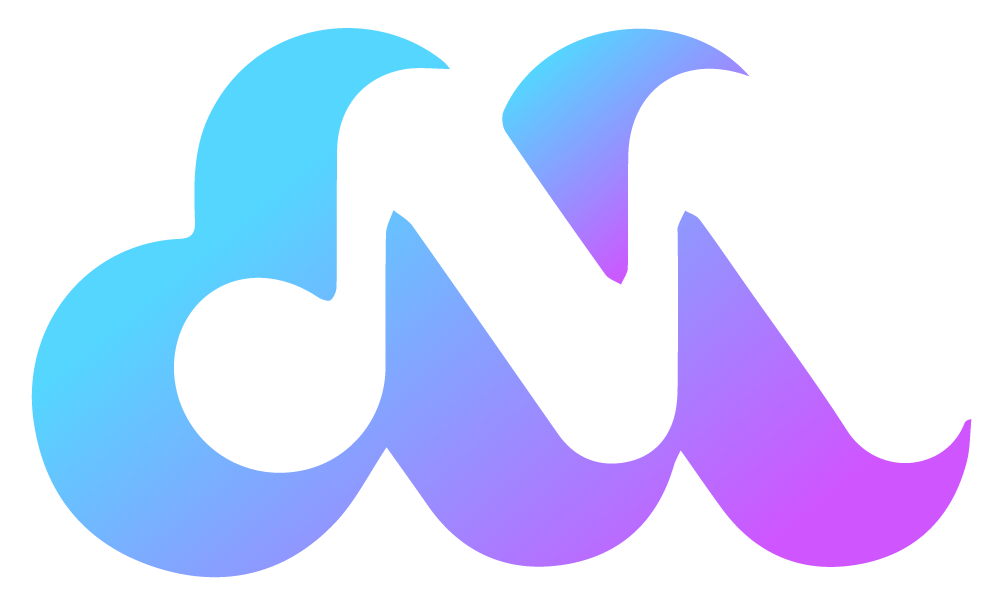

# 🎵M-Player

M-Player is a music player recorded in the cloud. one can listen to music from a smartphone, tablet, computer and smart TV.
each user has their own music to download by creating an account with their email address or with Google OAuth.
create with Html, Css,bootstrap,PHP, Mysql.

## ✨ Features
📂 Playing audio files
- 🎶 Manage playlists
- ⏯️ Simple controls (play/pause, next, previous, volume)
- 📱 Responsive and modern interface

## 🚀 Installation

git clone https://github.com/clementR97/M-Player.git

cd M-Player

npm install

npm start

## 📝Google Sign-in

in the callback.php and login.php
change  clientId, clientSecret and RedictUri by your google OAuth.

## 🌄Logo

## 📸Screen Shoot

when the mouse hovers over an album:

## 📱responsive

